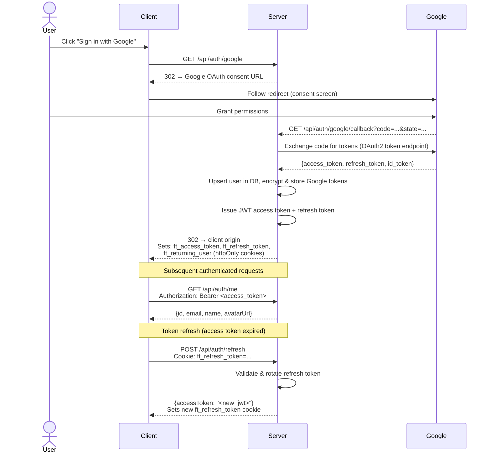

# API Contracts — Focused Tube (P1-2)

**Artifact:** api-summary · **Version:** 1.0 · **Generated:** 2026-04-24  
**Source:** [`api-summary.yaml`](./api-summary.yaml)

---

## Table of Contents

1. [Endpoint Overview](#endpoint-overview)
2. [Authentication Schemes](#authentication-schemes)
3. [OAuth + JWT Flow](#oauth--jwt-flow)
4. [Endpoint Contracts](#endpoint-contracts)
   - [Auth](#auth-endpoints)
   - [Profiles](#profile-endpoints)
   - [Subscriptions & Feed](#subscriptions--feed-endpoints)
   - [Community](#community-endpoints)
   - [Health](#health-endpoint)
5. [Error Response Patterns](#error-response-patterns)

---

## Endpoint Overview

| Method | Path | Auth | Summary |
|--------|------|------|---------|
| GET | `/api/auth/google` | ❌ | Redirect to Google OAuth consent screen |
| GET | `/api/auth/google/callback` | ❌ | Handle OAuth callback, issue JWT, set cookies |
| GET | `/api/auth/me` | ✅ JWT | Get current user info |
| POST | `/api/auth/refresh` | 🍪 Cookie | Rotate refresh token, issue new access token |
| POST | `/api/auth/logout` | ❌ | Clear all auth cookies |
| GET | `/api/profiles` | ✅ JWT | List user's profiles |
| POST | `/api/profiles` | ✅ JWT | Create a profile |
| GET | `/api/profiles/:id` | ✅ JWT | Get a profile (with channels & keywords) |
| PUT | `/api/profiles/:id` | ✅ JWT | Update a profile |
| DELETE | `/api/profiles/:id` | ✅ JWT | Delete a profile |
| POST | `/api/profiles/:id/channels` | ✅ JWT | Add channels to a profile |
| DELETE | `/api/profiles/:id/channels/:channelId` | ✅ JWT | Remove a channel |
| POST | `/api/profiles/:id/keywords` | ✅ JWT | Add keywords to a profile |
| DELETE | `/api/profiles/:id/keywords/:keywordId` | ✅ JWT | Remove a keyword |
| GET | `/api/subscriptions` | ✅ JWT | Fetch YouTube subscriptions |
| GET | `/api/feed/:profileId` | ✅ JWT | Combined subscription + keyword video feed |
| GET | `/api/health` | ❌ | Health check with quota usage |
| GET | `/api/community/profiles` | ✅ JWT | List public profiles |
| POST | `/api/community/profiles/:profileId/follow` | ✅ JWT | Follow a public profile |
| DELETE | `/api/community/profiles/:profileId/follow` | ✅ JWT | Unfollow a profile |
| GET | `/api/community/following` | ✅ JWT | List followed profiles |

---

## Authentication Schemes

The API uses two complementary auth mechanisms:

### 1. JWT Bearer Token

Sent in the `Authorization` header for all protected endpoints:

```
Authorization: Bearer <access_token>
```

- Access tokens are short-lived JWTs signed with `JWT_SECRET`
- Issued during the OAuth callback and on token refresh
- Validated by the `authenticateJwt` middleware on all protected routes

### 2. httpOnly Cookies

Three cookies are set by the server and managed automatically by the browser:

| Cookie | Purpose | Flags |
|--------|---------|-------|
| `ft_access_token` | Current JWT access token | httpOnly, Secure, SameSite |
| `ft_refresh_token` | Long-lived refresh token for rotation | httpOnly, Secure, SameSite |
| `ft_returning_user` | Non-sensitive flag for UI hint (returning user) | httpOnly, Secure, SameSite |

The `/api/auth/refresh` endpoint reads `ft_refresh_token` from the cookie (no Bearer header required) and responds with a new `accessToken` in the JSON body, while also rotating the cookie.

---

## OAuth + JWT Flow



---

## Endpoint Contracts

### Auth Endpoints

#### `GET /api/auth/google`

Initiates the OAuth 2.0 authorization code flow.

- **Auth required:** No
- **Response:** `302 Redirect` to Google's OAuth consent screen

---

#### `GET /api/auth/google/callback`

Handles the Google OAuth redirect, exchanges the authorization code for tokens, and establishes the session.

- **Auth required:** No
- **Query params:** `code` (string), `state` (string)
- **Response:** `302 Redirect` to client origin with auth cookies set

**Cookies set on success:**

```
Set-Cookie: ft_access_token=<jwt>; HttpOnly; Secure; SameSite=Lax
Set-Cookie: ft_refresh_token=<token>; HttpOnly; Secure; SameSite=Lax
Set-Cookie: ft_returning_user=true; HttpOnly; Secure; SameSite=Lax
```

---

#### `GET /api/auth/me`

Returns the authenticated user's profile from the database.

- **Auth required:** Yes (JWT Bearer)
- **Response `200`:**

```json
{
  "id": "clx1234abc",
  "email": "user@example.com",
  "name": "Jane Smith",
  "avatarUrl": "https://lh3.googleusercontent.com/..."
}
```

---

#### `POST /api/auth/refresh`

Rotates the refresh token and issues a new short-lived access token.

- **Auth required:** No (uses `ft_refresh_token` httpOnly cookie)
- **Response `200`:**

```json
{
  "accessToken": "eyJhbGciOiJIUzI1NiIsInR5cCI6IkpXVCJ9..."
}
```

- **Response `401`:** Refresh token missing, invalid, or expired

---

#### `POST /api/auth/logout`

Clears all auth cookies, effectively ending the session.

- **Auth required:** No
- **Response `200`:**

```json
{ "message": "Logged out" }
```

---

### Profile Endpoints

All profile endpoints require JWT Bearer authentication.

#### `GET /api/profiles`

Returns all profiles owned by the authenticated user.

- **Response `200`:**

```json
[
  {
    "id": "clx5678def",
    "name": "Tech & Science",
    "isDefault": true,
    "isPublic": false,
    "userId": "clx1234abc",
    "createdAt": "2026-01-15T10:00:00.000Z"
  }
]
```

---

#### `POST /api/profiles`

Creates a new profile for the authenticated user.

- **Request body:**

```json
{ "name": "Gaming" }
```

- **Response `201`:** Created profile object
- **Response `400`:** Missing or invalid `name`
- **Response `409`:** Profile name already exists for this user

---

#### `GET /api/profiles/:id`

Returns a single profile with its associated channels and keywords.

- **Response `200`:**

```json
{
  "id": "clx5678def",
  "name": "Tech & Science",
  "isDefault": true,
  "isPublic": false,
  "channels": [
    {
      "id": "clxchan001",
      "youtubeChannelId": "UCxxxxxx",
      "channelTitle": "Veritasium",
      "thumbnailUrl": "https://yt3.ggpht.com/..."
    }
  ],
  "keywords": [
    { "id": "clxkw001", "keyword": "machine learning" }
  ]
}
```

---

#### `PUT /api/profiles/:id`

Updates profile metadata. All fields are optional.

- **Request body:**

```json
{
  "name": "Tech & AI",
  "isDefault": true,
  "isPublic": true
}
```

- **Response `200`:** Updated profile object
- **Response `409`:** Name conflict with another profile

---

#### `DELETE /api/profiles/:id`

Deletes a profile and all its associated channels and keywords.

- **Response `200`:**

```json
{ "message": "Profile deleted" }
```

---

#### `POST /api/profiles/:id/channels`

Adds one or more YouTube channels to a profile. Existing channels are not duplicated.

- **Request body:**

```json
{
  "channels": [
    {
      "youtubeChannelId": "UCxxxxxx",
      "channelTitle": "Veritasium",
      "thumbnailUrl": "https://yt3.ggpht.com/..."
    }
  ]
}
```

- **Response `200`:** Updated profile with all channels

---

#### `DELETE /api/profiles/:id/channels/:channelId`

Removes a single channel from a profile.

- **`channelId`:** Internal database ID of the channel record (not the YouTube channel ID)
- **Response `200`:** `{ "message": "Channel removed" }`

---

#### `POST /api/profiles/:id/keywords`

Adds one or more search keywords to a profile.

- **Request body:**

```json
{ "keywords": ["machine learning", "quantum computing"] }
```

- **Response `200`:** Updated profile with all keywords

---

#### `DELETE /api/profiles/:id/keywords/:keywordId`

Removes a single keyword from a profile.

- **Response `200`:** `{ "message": "Keyword removed" }`

---

### Subscriptions & Feed Endpoints

#### `GET /api/subscriptions`

Fetches the authenticated user's YouTube channel subscriptions by proxying the YouTube Data API v3. Results reflect the user's actual Google account subscriptions.

- **Auth required:** Yes (JWT Bearer)
- **Response `200`:**

```json
[
  {
    "youtubeChannelId": "UCxxxxxx",
    "channelTitle": "Veritasium",
    "thumbnailUrl": "https://yt3.ggpht.com/..."
  }
]
```

- **Response `403`:** Google access token missing or revoked

---

#### `GET /api/feed/:profileId`

Returns a deduplicated, date-sorted video feed combining subscription uploads and keyword search results for the given profile.

- **Auth required:** Yes (JWT Bearer)
- **Path param:** `profileId` — must belong to the authenticated user
- **Query params:**

| Param | Type | Description |
|-------|------|-------------|
| `source` | `"subscriptions"` \| `"search"` | Filter to one source only (omit for both) |
| `pageToken` | string | YouTube pagination token from a previous response |

- **Response `200`:**

```json
{
  "videos": [
    {
      "id": "dQw4w9WgXcQ",
      "title": "Video Title",
      "channelId": "UCxxxxxx",
      "channelTitle": "Channel Name",
      "thumbnailUrl": "https://i.ytimg.com/vi/dQw4w9WgXcQ/mqdefault.jpg",
      "publishedAt": "2026-04-20T14:00:00.000Z",
      "source": "subscription"
    }
  ],
  "nextPageToken": "CAUQAA"
}
```

> **Quota note:** Each feed request may consume up to 100 YouTube API units per `search.list` call. With multiple channels and keywords, quota usage per request can be significant.

- **Response `429`:** YouTube API quota exceeded for the day

---

### Community Endpoints

All community endpoints require JWT Bearer authentication.

#### `GET /api/community/profiles`

Discovers public profiles created by any user. Supports keyword filtering and pagination.

- **Query params:**

| Param | Type | Default | Description |
|-------|------|---------|-------------|
| `keyword` | string | — | Filter by profile name or keyword tag |
| `page` | number | `1` | Page number |
| `limit` | number | `20` | Results per page |

- **Response `200`:**

```json
{
  "profiles": [
    {
      "id": "clx5678def",
      "name": "Tech & Science",
      "channelCount": 12,
      "keywordCount": 5,
      "followerCount": 34,
      "ownerName": "Jane Smith"
    }
  ],
  "total": 87,
  "page": 1
}
```

---

#### `POST /api/community/profiles/:profileId/follow`

Follows a public profile. The feed for the followed profile will appear in the user's community feed.

- **Response `200`:** `{ "message": "Following" }`
- **Response `403`:** Target profile is not public
- **Response `409`:** Already following this profile

---

#### `DELETE /api/community/profiles/:profileId/follow`

Unfollows a previously followed profile.

- **Response `200`:** `{ "message": "Unfollowed" }`

---

#### `GET /api/community/following`

Lists all public profiles the current user follows.

- **Response `200`:**

```json
[
  {
    "id": "clx5678def",
    "name": "Tech & Science",
    "ownerName": "Jane Smith",
    "followedAt": "2026-03-10T09:30:00.000Z"
  }
]
```

---

### Health Endpoint

#### `GET /api/health`

Returns server health and current YouTube API quota status. Useful for monitoring and debugging quota exhaustion.

- **Auth required:** No
- **Response `200`:**

```json
{
  "status": "ok",
  "quota": {
    "date": "2026-04-24",
    "used": 4200,
    "limit": 10000,
    "remaining": 5800
  }
}
```

---

## Error Response Patterns

All error responses follow a consistent JSON envelope:

```json
{
  "error": "Human-readable error message"
}
```

### Standard Status Codes

| Code | Meaning | Common Causes |
|------|---------|---------------|
| `400` | Bad Request | Missing required fields, invalid body format |
| `401` | Unauthorized | Missing or expired JWT; invalid/missing refresh token |
| `403` | Forbidden | Resource exists but access denied (e.g., private profile, revoked Google token) |
| `404` | Not Found | Profile, channel, or keyword ID does not exist or belongs to another user |
| `409` | Conflict | Duplicate profile name; already following a profile |
| `429` | Too Many Requests | YouTube Data API v3 daily quota (10,000 units) exhausted |

### Authentication Errors

```json
// 401 — No or invalid Bearer token
{ "error": "Unauthorized" }

// 401 — Refresh token missing or expired
{ "error": "Invalid or expired refresh token" }

// 403 — Google OAuth token revoked
{ "error": "Google access token unavailable. Please re-authenticate." }
```

### Validation Errors

```json
// 400 — Profile creation missing name
{ "error": "Profile name is required" }

// 409 — Duplicate profile name
{ "error": "A profile with that name already exists" }
```

### Quota Errors

```json
// 429 — YouTube API quota exceeded
{ "error": "YouTube API quota exceeded. Try again after midnight Pacific Time." }
```
