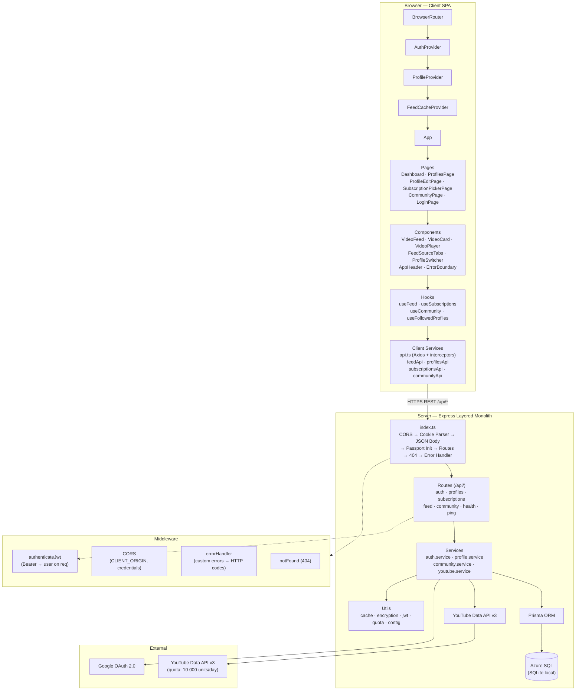
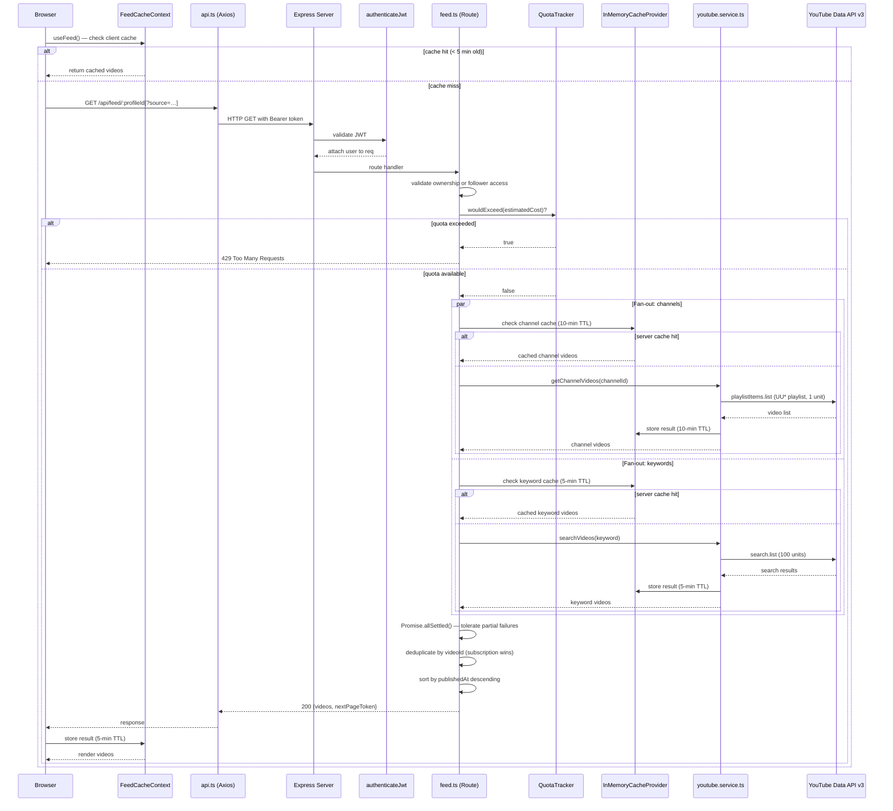
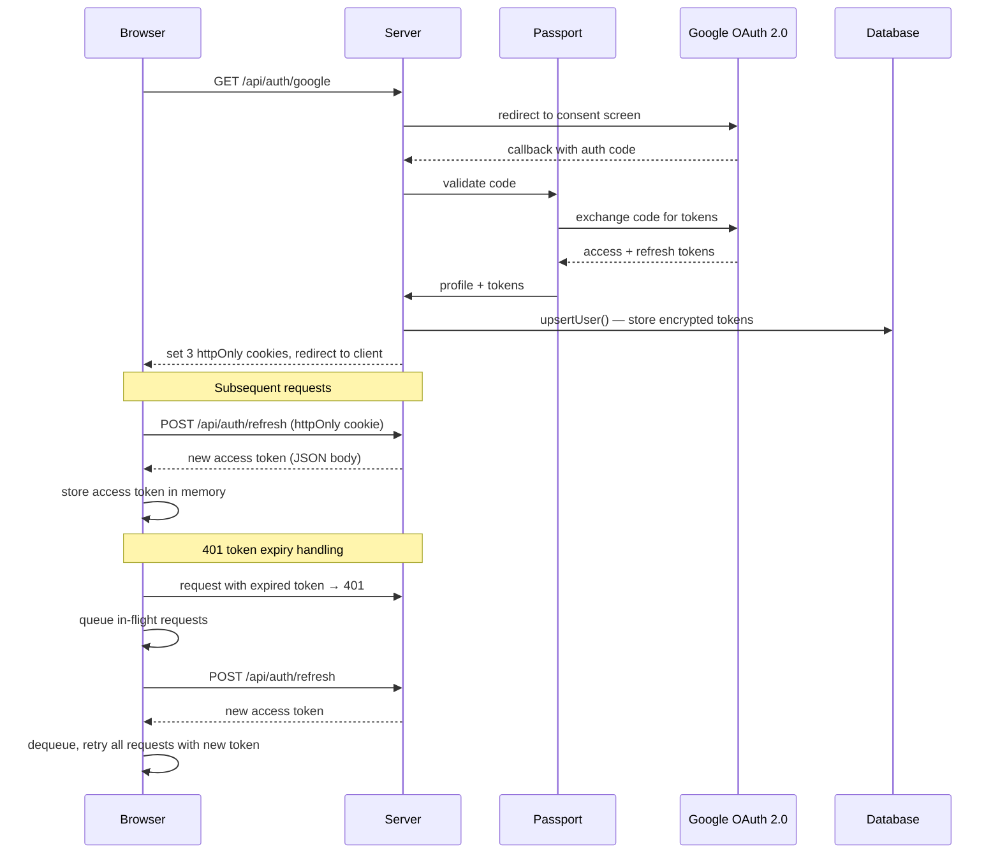

# Architecture Overview — Focused Tube

**Artifact:** P1-8  
**Version:** 1.0  
**Generated:** 2025-07-17  
**Repo:** focused-tube

---

## Overview

Focused Tube is an npm workspaces monorepo composed of a React 18 SPA (`client/`) and an Express REST API (`server/`). The server follows a layered monolith architecture — Routes → Services → Data Access — and proxies all YouTube Data API v3 calls on behalf of authenticated users. The client is a browser-hosted SPA that communicates exclusively via the server's REST API, maintains an access token in memory for XSS protection, and stores its own short-lived feed cache. Authentication is handled with Google OAuth 2.0; JWTs carry the session, with refresh tokens stored in httpOnly cookies. Together the two workspaces form a single deployable unit with a clear separation of concerns: the server owns all external integrations, persistence, and quota management, while the client owns presentation and user interaction state.

---

## Architecture Style

| Axis | Decision |
|---|---|
| Server | Layered monolith (Routes → Services → Data Access) |
| Client | Single-Page Application (React 18, Vite, TypeScript) |
| Communication | REST JSON API (`/api/*`) |
| State management | React Context API (no Redux) |
| Persistence | Prisma ORM over Azure SQL (SQLite for local dev) |
| External integrations | YouTube Data API v3 (server-side only) |
| Deployment shape | SPA + Node.js server, independently deployable |

---

## Component Diagram



---

## Layer / Module Breakdown

### Server

#### Entry Point — `server/src/index.ts`
Bootstraps the Express application. Middleware chain is applied in a fixed order:

1. CORS (restricted to `CLIENT_ORIGIN`, `credentials: true`)
2. Cookie parser
3. JSON body parser
4. Passport initialisation
5. Route mounting
6. 404 handler
7. Global error handler

#### Routes — `server/src/routes/`

| File | Responsibility |
|---|---|
| `auth.ts` | Google OAuth redirect, callback, JWT issuance, refresh, logout |
| `profiles.ts` | Profile CRUD; channel and keyword sub-resources |
| `subscriptions.ts` | Fetch authenticated user's YouTube subscriptions |
| `feed.ts` | Combined video feed — fan-out, quota guard, cache check, dedup, sort |
| `community.ts` | Public profile discovery, follow / unfollow |
| `health.ts` | Health check + quota usage status |
| `ping.ts` | Simple liveness probe |

Routes are kept thin — they validate input, call the appropriate service, and return HTTP responses. Business logic lives in services.

#### Services — `server/src/services/`

| File | Key Exports / Responsibilities |
|---|---|
| `auth.service.ts` | `upsertUser()` — creates or updates a user with encrypted Google tokens |
| `profile.service.ts` | `assertProfileOwnership()` — throws `NotFoundError`, `ConflictError`, `BadRequestError` |
| `community.service.ts` | `listPublicProfiles()`, `followProfile()`, `unfollowProfile()`, `listFollowedProfiles()` |
| `youtube.service.ts` | `getUserSubscriptions()`, `getChannelVideos()` (UC→UU playlist conversion), `searchVideos()`, token refresh, cache integration |

#### Utils — `server/src/utils/`

| File | Responsibility |
|---|---|
| `config.ts` | Centralised environment variables via dotenv |
| `cache.ts` | `InMemoryCacheProvider` — LRU + TTL, periodic sweep every 60 s, max 5 000 entries |
| `encryption.ts` | AES-256-GCM for Google tokens at rest; format: `<iv>:<authTag>:<ciphertext>` |
| `jwt.ts` | Sign / verify access tokens (15 min, HS256) and refresh tokens (30 days, HS256) |
| `quota.ts` | `QuotaTracker` — daily counter, resets midnight Pacific, `wouldExceed()` guard |
| `prisma.ts` | Prisma client singleton |

#### Middleware — `server/src/middleware/`

| File | Responsibility |
|---|---|
| `auth.ts` | `authenticateJwt()` — validates Bearer token, attaches user to `req` |
| `cors.ts` | CORS policy configuration |
| `errorHandler.ts` | Maps custom error types to HTTP status codes |
| `notFound.ts` | Catches unmatched routes with a 404 response |

#### Config — `server/src/config/`

| File | Responsibility |
|---|---|
| `passport.ts` | Registers the Google OAuth 2.0 Passport strategy |

---

### Client

#### Provider Stack — `client/src/main.tsx`

Providers are nested in this order (outermost first):

```
BrowserRouter → AuthProvider → ProfileProvider → FeedCacheProvider → Toaster → App
```

#### Routing — `client/src/App.tsx`

| Path | Page | Protected |
|---|---|---|
| `/login` | `LoginPage` | No |
| `/` | `Dashboard` | Yes |
| `/profiles` | `ProfilesPage` | Yes |
| `/profiles/:id/edit` | `ProfileEditPage` | Yes |
| `/profiles/:profileId/subscriptions` | `SubscriptionPickerPage` | Yes |
| `/community` | `CommunityPage` | Yes |

Route protection is enforced by `auth/ProtectedRoute.tsx`.

#### Contexts — `client/src/context/`

| Context | State & Behaviour |
|---|---|
| `AuthContext` | `user`, `isLoading`, `logout()`. On mount: `POST /api/auth/refresh`. Access token held **in memory only** — never persisted. |
| `ProfileContext` | `profiles[]`, `activeProfile`, `followedProfiles[]`, CRUD operations. Invalidates `FeedCacheContext` on any mutation. |
| `FeedCacheContext` | In-memory `Map` with 5-min TTL. Cache key: `${profileId}:${source ?? 'all'}`. |

#### Hooks — `client/src/hooks/`

| Hook | Responsibility |
|---|---|
| `useFeed(profileId, source?)` | Fetch + paginate feed, check client cache, deduplicate by `videoId`, expose `loadMore()` and `reset()` |
| `useSubscriptions()` | Fetch YouTube subscriptions with `fetchWithRetry` |
| `useCommunity()` | Debounced search, pagination, optimistic follow / unfollow |
| `useFollowedProfiles()` | Fetch followed profiles, optimistic unfollow |

#### Services — `client/src/services/`

| File | Responsibility |
|---|---|
| `api.ts` | Axios instance; request interceptor injects Bearer token; response interceptor queues requests on 401, performs a single refresh, then retries |
| `feedApi.ts` | Feed endpoint calls |
| `profilesApi.ts` | Profile + channel + keyword CRUD calls |
| `subscriptionsApi.ts` | Subscriptions endpoint call |
| `communityApi.ts` | Community search and follow / unfollow calls |

#### Components — `client/src/components/`

| Domain | Components |
|---|---|
| `auth/` | `ProtectedRoute.tsx` |
| `feed/` | `VideoFeed`, `VideoCard`, `VideoPlayer`, `FeedSourceTabs`, `VideoCardSkeleton` |
| `profile/` | `ProfileSwitcher` (owned + followed profiles) |
| `subscriptions/` | `SubscriptionChannelRow` |
| `ui/` | `AppHeader`, `ErrorBoundary`, `SettingsMenu`, `Skeleton` |

---

## Request Flow — Feed Fetch

The sequence below traces a `GET /api/feed/:profileId` request from the browser through to YouTube and back.



---

## Authentication Flow



---

## Design Patterns

| Pattern | Where Used | Purpose |
|---|---|---|
| **Layered architecture** | Server: routes → services → data access | Separation of concerns; routes stay thin |
| **Repository pattern** | Prisma as ORM abstraction | Decouples business logic from SQL dialect |
| **Service layer** | `server/src/services/` | Encapsulates business rules, reusable across routes |
| **Middleware chain** | Express middleware stack | Cross-cutting concerns (auth, CORS, error handling) without repeating logic in routes |
| **Context API / Provider pattern** | React: `AuthProvider`, `ProfileProvider`, `FeedCacheProvider` | Global state without Redux; each provider owns a single concern |
| **Interceptor pattern** | Axios `api.ts` | Automatic Bearer token injection and transparent 401 → refresh → retry |
| **Fan-out with `Promise.allSettled`** | `feed.ts` route | Parallel YouTube calls; partial failures don't abort the entire feed |
| **LRU cache with TTL** | `InMemoryCacheProvider` | Reduces YouTube API quota consumption for repeated feed requests |
| **Token bucket / quota guard** | `QuotaTracker` | Prevents daily quota exhaustion; returns 429 before hitting YouTube |
| **Optimistic UI updates** | `useCommunity`, `useFollowedProfiles` | Immediate UI feedback before server confirmation |
| **JWT in-memory storage** | `AuthContext` | Eliminates XSS attack surface from `localStorage` |
| **httpOnly cookie for refresh token** | Auth flow | JS-inaccessible, CSRF-limited refresh token storage |

---

## Key Design Decisions

### 1. `playlistItems.list` instead of `search.list` for channel uploads
**Context:** Fetching recent uploads for a subscribed channel can be done via `search.list` (100 quota units) or by converting the channel ID to its uploads playlist (`UC…` → `UU…`) and calling `playlistItems.list` (1 quota unit).  
**Decision:** Use `playlistItems.list` via the UU* playlist conversion.  
**Rationale:** 99% quota reduction per channel fetch. With a 10 000-unit daily quota and `search.list` costing 100 units per call, this decision is the single most important factor in the system's scalability. `search.list` is still used for keyword searches where no equivalent cheaper API exists.

### 2. JWT access token in memory; refresh token in httpOnly cookie
**Context:** JWTs must be stored somewhere on the client. `localStorage` is vulnerable to XSS. Cookies set without `httpOnly` are equally accessible to JavaScript.  
**Decision:** Access token is held in a React context variable (memory only, lost on page reload). Refresh token is set as an `httpOnly`, `SameSite=None;Secure` cookie.  
**Rationale:** Removes the primary XSS attack vector for token theft. On reload, `POST /api/auth/refresh` (using the httpOnly cookie) silently restores the access token. The `SameSite=None;Secure` policy is required because the SPA and API are deployed on different origins.

### 3. AES-256-GCM encryption for Google tokens at rest
**Context:** The server stores Google OAuth access and refresh tokens in the database to make YouTube API calls on behalf of users.  
**Decision:** Tokens are encrypted with AES-256-GCM before persistence, using a server-side `ENCRYPTION_KEY`. Format: `<iv>:<authTag>:<ciphertext>`.  
**Rationale:** Limits the blast radius of a database breach. An attacker with read access to the DB cannot use the tokens without the encryption key, which lives only in the server environment.

### 4. Azure SQL over SQLite for production
**Context:** SQLite is used for local development due to zero-configuration convenience.  
**Decision:** Production targets Azure SQL.  
**Rationale:** Azure SQL provides connection pooling, horizontal read scaling, managed backups, and aligns with the expected Azure-hosted deployment environment. Prisma abstracts the dialect difference, so the application code is unchanged between environments.

### 5. npm workspaces monorepo
**Context:** The client and server are tightly coupled (shared types would be beneficial; atomic deploys are desirable).  
**Decision:** A single repository with `client/` and `server/` as npm workspace packages, coordinated from a root `package.json`.  
**Rationale:** Enables atomic commits across the full stack, shared tooling configuration (`tsconfig.base.json`), and a single `package-lock.json`. No code is currently shared between workspaces, but the structure supports future extraction of a `shared/` package for types.

### 6. Server-side cache with two TTLs (10 min channels, 5 min keywords)
**Context:** Each feed request can fan out to many YouTube API calls. Without caching, repeated loads of the same feed would burn quota rapidly.  
**Decision:** `InMemoryCacheProvider` (LRU + TTL) caches channel video results for 10 minutes and keyword search results for 5 minutes.  
**Rationale:** Channel upload lists change infrequently; a longer TTL is acceptable. Keyword results can include breaking news content, so a shorter TTL balances freshness against quota. The client-side `FeedCacheContext` adds a further 5-minute layer to reduce round-trips entirely.

---

## Technical Debt

| Item | Location | Description |
|---|---|---|
| Incomplete token encryption | `server/src/prisma/schema.prisma` | A TODO comment in the Prisma schema suggests the at-rest encryption of Google tokens may not be applied uniformly to all token fields. This should be audited to confirm `accessToken` and `refreshToken` are always stored encrypted. |
| `FeedSourceTabs` commented out | `client/src/components/feed/FeedSourceTabs.tsx` | The source-filter tab component is implemented but commented out in the feed UI. The `?source=` query parameter is fully supported by the server; the client feature is simply disabled, possibly pending UX review. |
| In-memory cache not distributed | `server/src/utils/cache.ts` | `InMemoryCacheProvider` is process-local. Horizontal scaling (multiple Node.js instances) would result in cache misses and quota pressure. Migration to a shared cache (e.g., Redis) is required before multi-instance deployment. |
| No shared `types/` workspace package | Monorepo root | TypeScript interfaces are duplicated between `client/src/types/` and server-side types. A `packages/shared/` workspace would eliminate this drift but has not been introduced. |
| SQLite in development, Azure SQL in production | `server/src/utils/prisma.ts` | The schema is written for Azure SQL, but SQLite is used locally. Some SQL features (e.g., certain index types, full-text search) are not portable. Developers must be careful not to rely on SQLite-specific behaviour. |
