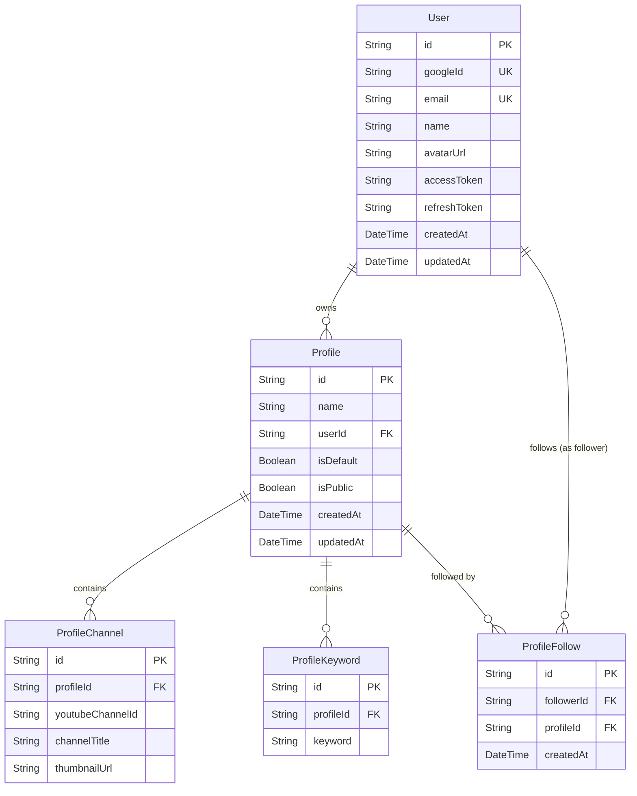

# Data Model — Focused Tube

**Artifact:** P1-3 | **Version:** 1.0 | **Generated:** 2026-04-24

---

## 1. Data Store Inventory

| Store | Type | Technology | Purpose |
|-------|------|------------|---------|
| `azure-sql` | Relational database | Azure SQL (SQL Server) via Prisma 6 | Primary persistent store for all application data |

A single Azure SQL database holds every entity. Prisma 6 (`prisma-client-js`) manages the schema and migrations. Migration files live at `server/src/prisma/migrations/`.

---

## 2. Entity Catalog

| Entity | Table | Description |
|--------|-------|-------------|
| `User` | `User` | Authenticated user created on Google OAuth callback. Holds identity fields and OAuth tokens. |
| `Profile` | `Profile` | A named curation profile owned by a user, grouping channels and keywords for feed generation. |
| `ProfileChannel` | `ProfileChannel` | A YouTube channel pinned to a profile; drives the subscription feed. |
| `ProfileKeyword` | `ProfileKeyword` | A keyword attached to a profile; drives the keyword-search feed. |
| `ProfileFollow` | `ProfileFollow` | Many-to-many join recording which users follow which public profiles. |

All five entities are **owned by this repository**. There are no shared or externally-owned tables.

---

## 3. ER Diagram

---

## 4. Schema Details

### 4.1 User

Represents an authenticated Google user. Created (or upserted) on OAuth callback.

| Field | Type | Constraints | Classification | Notes |
|-------|------|-------------|----------------|-------|
| `id` | `String` | PK, UUID, auto | internal | UUID v4 auto-generated |
| `googleId` | `String` | Unique, not null | internal | Google OAuth subject identifier |
| `email` | `String` | Unique, not null | **PII** | Google account email |
| `name` | `String` | not null | **PII** | Display name from Google profile |
| `avatarUrl` | `String?` | nullable | **PII** | Profile picture URL |
| `accessToken` | `String` | not null | **sensitive** | ⚠️ See security note below |
| `refreshToken` | `String` | not null | **sensitive** | ⚠️ See security note below |
| `createdAt` | `DateTime` | not null, default `now()` | internal | |
| `updatedAt` | `DateTime` | not null, auto-update | internal | |

> **⚠️ Security gap — token encryption:**
> `ARCHITECTURE.md` describes `accessToken` and `refreshToken` as encrypted with AES-256-GCM before being written to the database. However, the Prisma schema contains an inline `TODO` comment on both fields stating *"Encrypt at rest (Phase 2) — currently stored in plaintext."*
> **Current state:** tokens are stored in plaintext. Encryption has been deferred to a Phase 2 implementation. Until that work is complete, a database breach would expose valid OAuth tokens. This should be treated as a **high-risk open item**.

---

### 4.2 Profile

A named curation set owned by one user. The unique constraint `(userId, name)` prevents duplicate profile names per user.

| Field | Type | Constraints | Classification | Notes |
|-------|------|-------------|----------------|-------|
| `id` | `String` | PK, UUID, auto | internal | |
| `name` | `String` | not null | internal | Unique per user — see composite unique below |
| `userId` | `String` | FK → `User.id`, not null | internal | Cascade delete |
| `isDefault` | `Boolean` | not null, default `false` | internal | User's default profile |
| `isPublic` | `Boolean` | not null, default `false` | internal | Enables following by other users |
| `createdAt` | `DateTime` | not null, default `now()` | internal | |
| `updatedAt` | `DateTime` | not null, auto-update | internal | |

**Unique constraint:** `(userId, name)`

---

### 4.3 ProfileChannel

A YouTube channel attached to a profile. Channel metadata (`channelTitle`, `thumbnailUrl`) is cached from the YouTube Data API v3 at the time of addition to avoid repeated API calls.

| Field | Type | Constraints | Classification | Notes |
|-------|------|-------------|----------------|-------|
| `id` | `String` | PK, UUID, auto | internal | |
| `profileId` | `String` | FK → `Profile.id`, not null | internal | Cascade delete |
| `youtubeChannelId` | `String` | not null | internal | YouTube channel ID (e.g. `UCxxxxxx`) |
| `channelTitle` | `String` | not null | internal | Cached display name |
| `thumbnailUrl` | `String?` | nullable | internal | Cached thumbnail URL |

**Unique constraint:** `(profileId, youtubeChannelId)`

---

### 4.4 ProfileKeyword

A free-text search keyword attached to a profile. Each keyword drives one `youtube.search.list` call (100 quota units) at feed-load time.

| Field | Type | Constraints | Classification | Notes |
|-------|------|-------------|----------------|-------|
| `id` | `String` | PK, UUID, auto | internal | |
| `profileId` | `String` | FK → `Profile.id`, not null | internal | Cascade delete |
| `keyword` | `String` | not null | internal | Free-text search term |

**Unique constraint:** `(profileId, keyword)`

---

### 4.5 ProfileFollow

Join table enabling users to follow public profiles they do not own. The `onDelete: NoAction` on the follower FK is required by SQL Server to avoid multi-path cascade cycles (a user's own profiles already cascade-delete through `Profile`).

| Field | Type | Constraints | Classification | Notes |
|-------|------|-------------|----------------|-------|
| `id` | `String` | PK, UUID, auto | internal | |
| `followerId` | `String` | FK → `User.id`, not null | internal | `onDelete: NoAction` — SQL Server cycle constraint |
| `profileId` | `String` | FK → `Profile.id`, not null | internal | Cascade delete |
| `createdAt` | `DateTime` | not null, default `now()` | internal | |

**Unique constraint:** `(followerId, profileId)`

---

## 5. Data Ownership

All entities are owned and managed exclusively by the `focused-tube` repository. There are no cross-service foreign keys and no shared tables.

| Entity | Owner | Notes |
|--------|-------|-------|
| `User` | focused-tube | Authoritative user record |
| `Profile` | focused-tube | |
| `ProfileChannel` | focused-tube | YouTube channel IDs sourced from YouTube API, not stored externally |
| `ProfileKeyword` | focused-tube | |
| `ProfileFollow` | focused-tube | |

---

## 6. Data Flows

### Inbound (writes to the database)

| Trigger | Entities Written | Description |
|---------|-----------------|-------------|
| Google OAuth callback `POST /api/auth/google/callback` | `User` | Creates or upserts the `User` row; writes `googleId`, `email`, `name`, `avatarUrl`, `accessToken`, `refreshToken` |
| Server-side token refresh | `User` | Updates `accessToken` (and optionally `refreshToken`) when the Google access token expires |
| Profile CRUD `POST/PUT/DELETE /api/profiles` | `Profile`, `ProfileChannel`, `ProfileKeyword` | Creates, renames, and deletes profiles; adds/removes channels and keywords |
| Follow API `POST /api/profiles/:id/follow` | `ProfileFollow` | Creates a `ProfileFollow` row linking the requesting user to a public profile |
| Unfollow API `DELETE /api/profiles/:id/follow` | `ProfileFollow` | Deletes the corresponding `ProfileFollow` row |

### Outbound (reads from the database, no writes)

| Trigger | Entities Read | Description |
|---------|--------------|-------------|
| Feed API `GET /api/feed/:profileId` | `Profile`, `ProfileChannel`, `ProfileKeyword` | Loads the profile's channels and keywords to parameterise YouTube Data API v3 `search.list` calls |
| Subscriptions API `GET /api/subscriptions` | `User` | Reads the user's `accessToken` to authenticate the YouTube `subscriptions.list` call |
| Profile list `GET /api/profiles` | `Profile` | Returns all profiles owned by (or followed by) the authenticated user |

---

## 7. Data Classification Summary

| Classification | Fields |
|---------------|--------|
| **PII** | `User.email`, `User.name`, `User.avatarUrl` |
| **Sensitive** | `User.accessToken`, `User.refreshToken` |
| **Internal** | All other fields |

---

## Cross-References

- [schema.yaml](./schema.yaml) — machine-parseable companion artifact (P1-3)
- [repo-identity.yaml](../repo-identity.yaml) — repository identity (P1-1)
- [dependencies.yaml](../dependencies.yaml) — external service and library dependencies (P1-4)
- [security.yaml](../security.yaml) — security posture including token encryption gap (P1-9)
