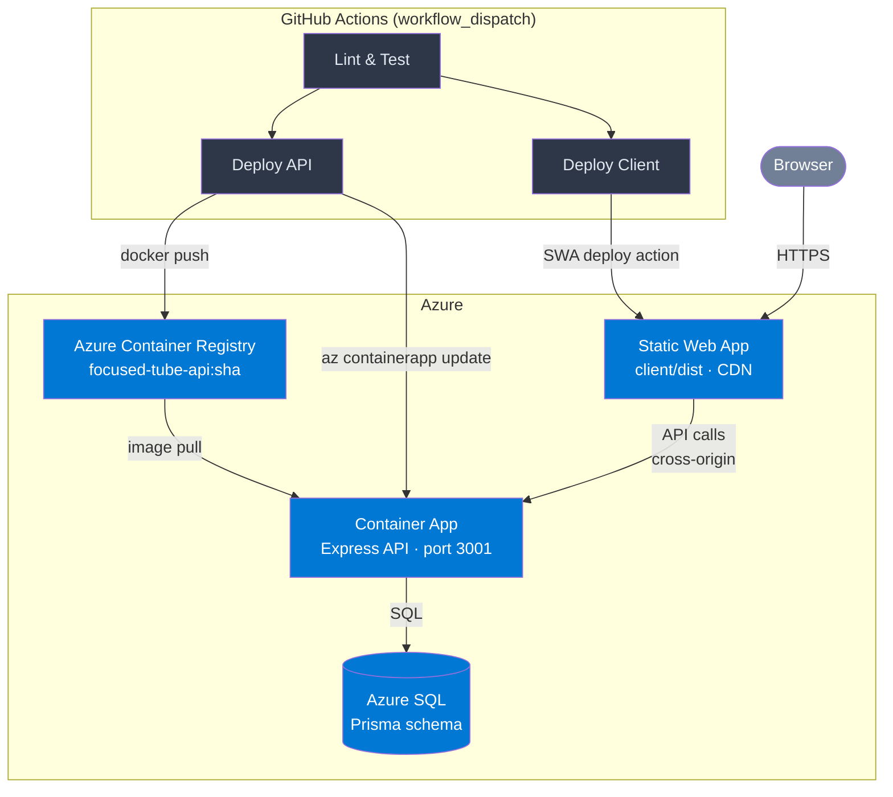
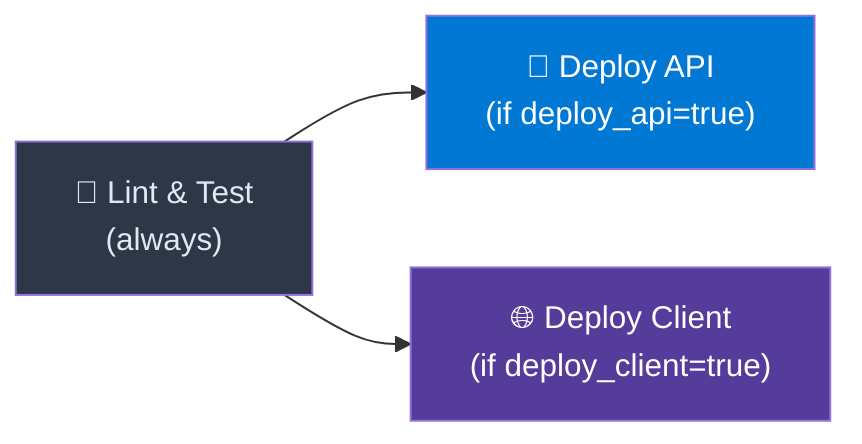

# P1-7 Deployment — Focused Tube

> **Artifact:** `deployment` · **Version:** 1.0 · **Generated:** 2026-04-24
> **Source of truth:** [`deployment.yaml`](./deployment.yaml) · **Ops guide:** [`DEPLOYMENT.md`](../../../DEPLOYMENT.md)

---

## 1. Infrastructure Overview

Focused Tube uses a **mixed-platform** deployment: the React SPA is served as a static site, while the Express API runs as a containerised workload.

| Component | Azure Service | Purpose |
|-----------|---------------|---------|
| **Frontend (SPA)** | Azure Static Web Apps | Serves the React SPA via global CDN, HTTPS by default |
| **Backend (API)** | Azure Container Apps | Runs the Express API container; external ingress on port 3001 |
| **Container Registry** | Azure Container Registry (ACR) | Stores Docker images tagged by commit SHA and `latest` |
| **Database** | Azure SQL | Persistent store — Users, Profiles, Channels, Keywords |
| **Identity** | Microsoft Entra ID | OIDC federated credentials for GitHub Actions (no long-lived secrets) |

---

## 2. Deployment Architecture



---

## 3. CI/CD Pipeline

The pipeline is defined in [`.github/workflows/ci-cd.yml`](../../../.github/workflows/ci-cd.yml) and is triggered manually via **`workflow_dispatch`** with two boolean inputs: `deploy_api` and `deploy_client`.

### Pipeline Jobs



| Job | Needs | Condition | Key Steps |
|-----|-------|-----------|-----------|
| **Lint & Test** | — | Always | `npm ci` → `npm run build` → `npm run test` |
| **Deploy API** | test | `inputs.deploy_api == true` | OIDC login → Docker build+push to ACR → `az containerapp update` |
| **Deploy Client** | test | `inputs.deploy_client == true` | `npm run build --workspace=client` → Azure Static Web Apps deploy action |

### Docker Image Tags (API)

Each API deployment produces two tags pushed to ACR:

- `focused-tube-api:<github.sha>` — immutable, used for the Container App update
- `focused-tube-api:latest` — convenience alias

### Authentication

GitHub Actions authenticates to Azure using **OIDC federated credentials** (Microsoft Entra ID app registration), avoiding long-lived Azure credentials stored as secrets.

---

## 4. Environment Configuration

### API (Container App)

| Variable | Sensitivity | Storage | Notes |
|----------|-------------|---------|-------|
| `PORT` | public | env var | `3001` |
| `NODE_ENV` | public | env var | `production` |
| `CLIENT_ORIGIN` | internal | env var | Static Web App URL — used for CORS and cookie config |
| `GOOGLE_CALLBACK_URL` | internal | env var | Container App FQDN + `/api/auth/google/callback` |
| `DATABASE_URL` | secret | Container App secret | Azure SQL connection string (Prisma format) |
| `GOOGLE_CLIENT_ID` | secret | Container App secret | |
| `GOOGLE_CLIENT_SECRET` | secret | Container App secret | |
| `JWT_SECRET` | secret | Container App secret | |
| `JWT_REFRESH_SECRET` | secret | Container App secret | |
| `ENCRYPTION_KEY` | secret | Container App secret | Encrypts Google OAuth tokens at rest |

> **Secret values are never stored in source control or CI logs.** All sensitive configuration is stored as Azure Container App secrets and referenced via `secretref:` bindings.

### GitHub Actions

**Secrets:** `AZURE_CLIENT_ID`, `AZURE_TENANT_ID`, `AZURE_SUBSCRIPTION_ID`, `ACR_USERNAME`, `ACR_PASSWORD`, `SWA_DEPLOYMENT_TOKEN`

**Variables:** `ACR_LOGIN_SERVER`, `AZURE_RESOURCE_GROUP`, `CONTAINER_APP_NAME`, `CONTAINER_APP_FQDN`

---

## 5. Networking & Cross-Origin Notes

The SPA and API are deployed to **separate domains**, which creates cross-origin requirements:

- The Container App exposes **external ingress on port 3001** with Azure-managed TLS
- The Static Web App is served via the **Azure global CDN** with HTTPS by default
- Auth cookies are configured with **`SameSite=None; Secure`** to work across origins
- `CLIENT_ORIGIN` on the API must match the Static Web App URL exactly (including `https://`)
- The Google OAuth client must list both the SWA origin (JS origins) and the Container App callback URL (redirect URIs)

---

## 6. Rollback Procedures

### API Rollback (Container Apps revision management)

Azure Container Apps maintains a history of immutable revisions. To roll back:

```bash
# 1. List recent revisions
az containerapp revision list \
  --name <CONTAINER_APP_NAME> \
  --resource-group <RESOURCE_GROUP> \
  --query "[].{name:name, active:properties.active, created:properties.createdTime}" -o table

# 2. Activate the previous revision
az containerapp revision activate \
  --name <CONTAINER_APP_NAME> --resource-group <RESOURCE_GROUP> \
  --revision <PREVIOUS_REVISION_NAME>

# 3. Route 100% traffic to it
az containerapp ingress traffic set \
  --name <CONTAINER_APP_NAME> --resource-group <RESOURCE_GROUP> \
  --revision-weight <PREVIOUS_REVISION_NAME>=100
```

### Client Rollback

Re-run the **Deploy Client** job from a previous successful workflow run in GitHub Actions (`Actions → CI/CD → select previous run → Re-run jobs`).

### Database Rollback

> ⚠️ **No automatic down migrations.** Prisma does not support automatic rollback for SQL Server.  
> If a migration must be reversed, write and apply a **corrective migration** manually. Always test migrations in a staging environment before deploying to production.

---

## 7. Health Check

After deployment, verify the API is healthy:

```bash
curl https://<CONTAINER_APP_FQDN>/api/health
# Expected: { "status": "ok", "quota": { ... } }
```

---

## Cross-References

- **Detailed deployment runbook:** [`DEPLOYMENT.md`](../../../DEPLOYMENT.md)
- **CI/CD workflow source:** [`.github/workflows/ci-cd.yml`](../../../.github/workflows/ci-cd.yml)
- **Container image definition:** [`server/Dockerfile`](../../../server/Dockerfile)
- **SPA routing config:** [`client/public/staticwebapp.config.json`](../../../client/public/staticwebapp.config.json)
- **Machine-readable artifact:** [`deployment.yaml`](./deployment.yaml)
- **Operations profile:** [`operations.yaml`](./operations.yaml)
