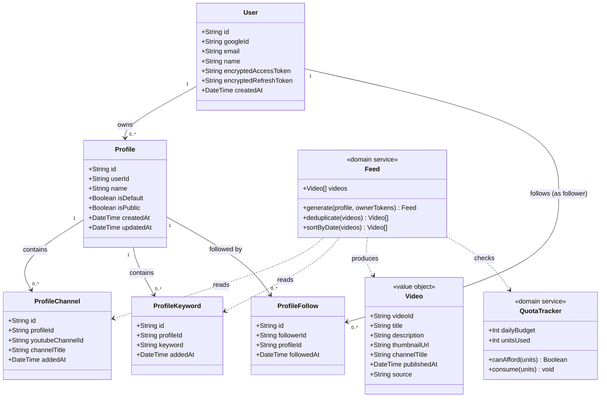
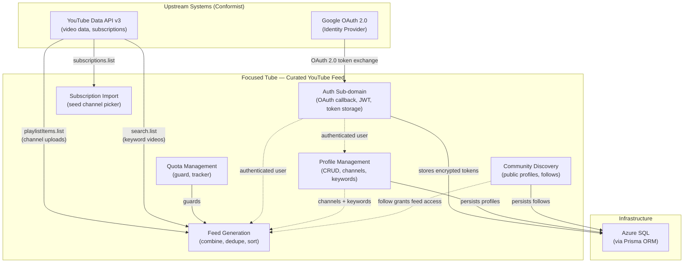

# Domain Context — Focused Tube (P1-10)

**Artifact**: P1-10  
**Version**: 1.0  
**Generated**: 2025-01-31  
**Repo**: focused-tube

---

## 1. Bounded Context Summary

**Name**: Focused Tube — Curated YouTube Feed

Focused Tube is a YouTube overlay web application whose core purpose is to liberate users from YouTube's recommendation algorithm. It provides a clean, subscription-and-keyword-driven video feed that the user fully controls through named **Profiles**.

**Scope**: User authentication, profile management (channels + keywords), public profile discovery, follow relationships, and curated video feed generation from the YouTube Data API v3.

**Strategic pattern**: Conformist with respect to Google OAuth and YouTube Data API v3. Focused Tube adapts its data model, quota strategy, and authentication flow entirely to those upstream systems without negotiation.

**Internal boundaries**:

| Sub-domain | Type | Responsibility |
|---|---|---|
| Identity & Auth | Supporting | Google OAuth handshake, JWT session tokens, encrypted token storage |
| Profile Management | Core | Create/edit/delete profiles; assign channels and keywords |
| Community Discovery | Supporting | Public profile listing, follow/unfollow relationships |
| Feed Generation | Core | Combine and deduplicate channel-upload videos and keyword-search videos |
| Quota Management | Supporting | Track and guard YouTube API daily quota consumption |
| Subscription Import | Supporting | Pull a user's YouTube subscriptions to seed channel selection |

---

## 2. Ubiquitous Language Glossary

All engineers and product stakeholders use the following terms consistently. The **Code Representation** column maps each term to its primary implementation artefact.

| Term | Business Meaning | Code Representation |
|---|---|---|
| **User** | An authenticated Google identity with YouTube subscriptions | `User` Prisma model; `AuthContext` / `useAuth` hook |
| **Profile** | A named curation preset owned by a User, containing channels and keywords that define a feed | `Profile` Prisma model; `ProfileContext` / `useProfiles` hook |
| **Channel** | A YouTube channel assigned to a Profile for subscription-based video retrieval | `ProfileChannel` Prisma model; `youtubeChannelId` field |
| **Keyword** | A search term assigned to a Profile for keyword-based video retrieval | `ProfileKeyword` Prisma model; normalised to lowercase |
| **Feed** | The combined, deduplicated, date-sorted list of Videos for a Profile | `GET /api/feed/:profileId`; `useFeed` hook |
| **Subscription** | A YouTube channel that a User subscribes to on YouTube (imported, not stored) | `getUserSubscriptions()` service; `SubscriptionPicker` component |
| **Default Profile** | The active profile automatically loaded on application startup | `Profile.isDefault` flag; atomically toggled |
| **Public Profile** | A profile visible to all authenticated users for discovery and following | `Profile.isPublic` flag |
| **Follow** | A User's subscription to another User's public Profile | `ProfileFollow` Prisma model; `followerId` → `profileId` |
| **Quota** | YouTube Data API v3 daily usage budget (10,000 units per day) | `QuotaTracker`; `QUOTA_COSTS` constants |
| **Source** | The origin of a video in the Feed — either a channel upload or a keyword search result | `Video.source: "subscription" \| "search"` |
| **Channel Upload** | A video fetched from a channel's uploads playlist via `playlistItems.list` | `getChannelVideos()` service |
| **Keyword Search** | A video fetched via `search.list` for a keyword term | `searchVideos()` service |
| **Feed Cache** | Server-side and client-side caches that store recent Feed results to reduce quota consumption | `InMemoryCacheProvider`; `FeedCacheContext` |
| **Quota Guard** | The server-side check that rejects Feed requests when the daily quota would be exceeded | Middleware / service guard before YouTube API calls |
| **Profile Owner** | The User who created a Profile | `Profile.userId` foreign key |
| **Follower** | A User who has followed another User's public Profile | `ProfileFollow.followerId` |
| **Token Encryption** | Symmetric encryption applied to Google access/refresh tokens at rest | `server/src/utils/encryption` utilities |

---

## 3. Aggregate Map

### Aggregate 1 — User

| Element | Type | Notes |
|---|---|---|
| `User` | **Aggregate Root** | Identified by Google Subject ID |
| `Profile[]` | Child collection | All profiles owned by this user |
| `ProfileFollow[]` (as follower) | Child collection | Profiles this user follows |

**Invariants**:
- Exactly zero or one Profile per user may have `isDefault = true` at any time.
- A user cannot follow their own profiles.

---

### Aggregate 2 — Profile

| Element | Type | Notes |
|---|---|---|
| `Profile` | **Aggregate Root** | Identified by UUID; owned by one User |
| `ProfileChannel[]` | Child collection | YouTube channels assigned to this profile |
| `ProfileKeyword[]` | Child collection | Keywords assigned to this profile |
| `ProfileFollow[]` (as followed) | Child collection | Users who follow this profile |

**Invariants**:
- Profile names are unique per user and between 1–100 characters.
- Keywords are stored normalised to lowercase.
- Only a public (`isPublic = true`) Profile may be followed.

---

### Aggregate 3 — ProfileFollow

| Element | Type | Notes |
|---|---|---|
| `ProfileFollow` | **Aggregate Root** | Identified by composite `(followerId, profileId)` |

**Invariants**:
- A user may follow a given profile at most once (unique constraint).
- A user may not follow their own profile.
- Only public profiles may be followed.

---

### Value Object — Video

`Video` is not persisted. It is assembled at feed-generation time from YouTube API responses and carries: `videoId`, `title`, `description`, `thumbnailUrl`, `channelTitle`, `publishedAt`, `source ("subscription" | "search")`.

---

### Domain Service — Feed

Feed generation is a stateless domain service that:
1. Calls `getChannelVideos()` for each `ProfileChannel`.
2. Calls `searchVideos()` for each `ProfileKeyword`.
3. Deduplicates by `videoId`.
4. Sorts descending by `publishedAt`.
5. Tags each `Video` with its `source`.
6. Enforces the Quota Guard before making any YouTube API calls.

---

## 4. Domain Model Diagram

---

## 5. Context Map

> **Relationship types**:  
> — Solid arrows = data flow at runtime  
> — Dashed arrows = domain dependency / authorisation grant  
> — No downstream consumers exist; Focused Tube publishes no events or APIs to external systems.

---

## 6. Business Rules

1. **Profile name uniqueness**: Profile names must be unique per user and between 1 and 100 characters in length.
2. **Keyword normalisation**: Keywords are stored and matched in lowercase; leading/trailing whitespace is trimmed at write time.
3. **Atomic default profile**: Setting a profile's `isDefault` flag to `true` atomically clears `isDefault` on all other profiles belonging to the same user.
4. **Follow uniqueness**: A user may follow a given profile at most once (enforced by a unique constraint on `[followerId, profileId]`).
5. **No self-follow**: A user cannot follow any profile they own.
6. **Public-only follows**: Only profiles with `isPublic = true` may be followed or appear in community discovery.
7. **Feed access control**: Feed data for a profile is accessible to the profile's owner and to any user who follows that profile. Feed calls use the profile owner's YouTube credentials regardless of who is requesting.
8. **Quota guard**: The feed endpoint rejects requests with HTTP 429 when the estimated YouTube API quota cost of the request would cause the daily budget (10,000 units) to be exceeded.
9. **Subscription data is ephemeral**: YouTube subscription lists are fetched live from the YouTube API and are never persisted in the application database.
10. **Token security**: Google access and refresh tokens are stored encrypted at rest using symmetric encryption; they are never logged or returned to the client in plaintext.

---

## 7. Domain Events

> These are **conceptual domain events**. They are not implemented as asynchronous messages or an event bus. They represent significant state transitions within the domain and are listed here to document the intended semantics and potential future integration points.

| Event | Trigger | Key Data |
|---|---|---|
| `UserRegistered` | First successful Google OAuth callback for a new identity | `userId`, `email`, `googleId` |
| `UserLoggedIn` | Successful Google OAuth callback for a returning user | `userId`, `email` |
| `ProfileCreated` | User creates a new profile | `profileId`, `userId`, `name`, `isPublic` |
| `ProfileUpdated` | User renames, toggles visibility, or sets as default | `profileId`, changed fields |
| `ProfileDeleted` | User deletes a profile | `profileId`, `userId` |
| `ChannelAddedToProfile` | User assigns a YouTube channel to a profile | `profileId`, `youtubeChannelId`, `channelTitle` |
| `ChannelRemovedFromProfile` | User removes a YouTube channel from a profile | `profileId`, `youtubeChannelId` |
| `KeywordAddedToProfile` | User adds a keyword to a profile | `profileId`, `keyword` |
| `KeywordRemovedFromProfile` | User removes a keyword from a profile | `profileId`, `keyword` |
| `FeedRequested` | Client requests the feed for a profile | `profileId`, `requesterId`, estimated quota cost |
| `QuotaExceeded` | Feed request rejected due to quota guard | `profileId`, `unitsRequested`, `unitsAvailable` |
| `ProfileFollowed` | User follows a public profile | `followerId`, `profileId` |
| `ProfileUnfollowed` | User unfollows a profile | `followerId`, `profileId` |

---

*Generated by GitHub Copilot — architecture documentation agent.*
