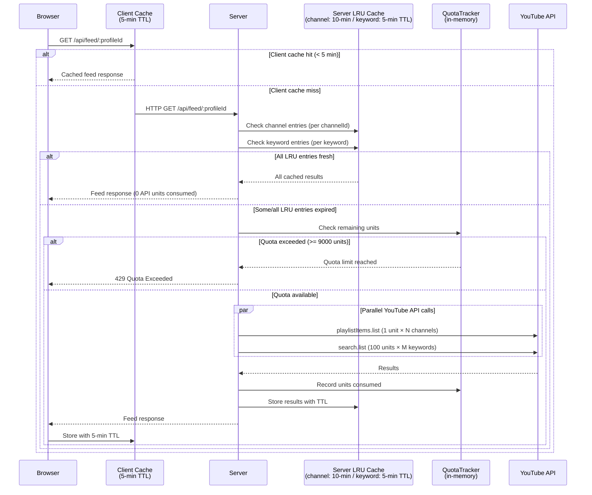

# Runtime Behavior Profile — Focused Tube

**Artifact:** P1-13 · `runtime-behavior`
**Generated:** 2026-04-24
**Repo:** focused-tube

---

## Overview

Focused Tube is a personal-scale YouTube overlay app hosted on Azure Container Apps. No APM platform, structured logging, or custom metrics are instrumented in the application code. **All quantitative runtime metrics in this document are `unavailable`** — the values documented here are either inferred from code analysis or described qualitatively.

The sections below explain what instrumentation does exist, the known runtime characteristics that can be derived from code, and concrete recommendations for closing observability gaps.

---

## What Instrumentation Exists

| Signal | Source | Coverage |
|---|---|---|
| YouTube API quota usage | `QuotaTracker` in-memory class | Daily unit count, resets at midnight UTC |
| Quota health | `GET /api/health` endpoint | Returns `{status, quota: {date, used, limit, remaining}}` |
| Cache events | `console.log` statements | Cache hit/miss logged to stdout |
| Auth flow steps | `console.log` statements | OAuth callback progress logged to stdout |
| CPU / memory / request count | Azure Monitor (Container Apps) | Platform-level only — not ingested by application code |

There is no APM SDK, no structured log shipping, no request ID propagation, and no custom metric export.

---

## Known Runtime Characteristics

### Feed Endpoint Latency

The `/api/feed/:profileId` endpoint is the most latency-sensitive path. Its response time is almost entirely determined by:

1. **Cache state** — whether the server-side LRU cache holds fresh results for the requested channels and keywords.
2. **YouTube API call count** — channels and keywords each require a separate API call.

| Scenario | Latency Estimate | YouTube API Units |
|---|---|---|
| Fully cached (all channels + keywords hit LRU) | < 10ms | 0 |
| Partial cache (some entries expired) | 200–800ms per miss | 1–100 per miss |
| Fully uncached — 5 channels + 3 keywords | ~300–800ms (parallel) | 305 units |
| Fully uncached — 10 channels + 5 keywords | ~300–800ms (parallel) | 510 units |

All YouTube API calls within a single feed request are dispatched in parallel via `Promise.all`. The observed latency is the slowest call in the batch, not the sum.

### Token Lifecycle

```
Access token:   issued on login → valid 15 minutes → transparent server-side refresh
Refresh token:  valid 30 days   → expiry requires full re-authentication
Tokens at rest: encrypted in Azure SQL
Tokens in transit: JWT in Authorization header / HTTP-only cookie
```

### Azure SQL Queries

All profile, channel, keyword, and user reads hit Azure SQL through Prisma ORM. Expected query latency is 10–50ms, depending on Azure region co-location between the Container App and the SQL instance.

---

## YouTube API Quota Cost Model

The YouTube Data API v3 enforces a daily quota of **10,000 units**, resetting at midnight UTC. The application applies a **9,000-unit soft limit** to leave headroom.

```
playlistItems.list  =   1 unit   (used for channel subscription feeds)
search.list         = 100 units  (used for keyword searches)
subscriptions.list  =   1 unit   (used to import YouTube subscriptions)
```

**Worst-case cost per feed request (uncached):**

```
  5 channels  × 1 unit   =    5 units
  3 keywords  × 100 units = 300 units
  ─────────────────────────────────────
  Total                  = 305 units
```

At this cost, a single user could exhaust the daily quota in ~32 fully uncached feed loads. The server-side cache dramatically reduces this in practice.

---

## Caching and Quota Flow



---

## Dependency Call Characteristics

| Dependency | Estimated Latency | Quota Cost | Cache TTL | Notes |
|---|---|---|---|---|
| YouTube `playlistItems.list` | 200–500ms | 1 unit | 600s | Parallelised per feed request |
| YouTube `search.list` | 300–800ms | 100 units | 300s | Parallelised per feed request |
| YouTube `subscriptions.list` | 200–500ms | 1 unit | None | On-demand import only |
| Azure SQL (Prisma) | 10–50ms | — | None | Single-instance; all authenticated endpoints |
| Google OAuth (token refresh) | 150–300ms | — | — | Transparent refresh on access token expiry |

All latency estimates are inferred from typical API behaviour — not measured from production.

---

## Scaling Considerations

Focused Tube runs as a **single Express process** per Azure Container Apps instance. This has two important implications:

1. **LRU cache is per-instance.** If Container Apps scales to more than one instance, each instance maintains its own cache — there is no cache sharing. Cache hit rates will drop under horizontal scale until a shared cache (e.g., Azure Cache for Redis) is introduced.

2. **QuotaTracker is per-instance.** The daily YouTube API unit counter is stored in memory. Multiple instances would each track quota independently, making it possible to collectively exceed the hard quota limit even if each instance believes it is under the soft limit.

For a personal-scale deployment (single instance), neither issue is a concern. Both become critical if the app is scaled.

---

## Error Modes

| Error | HTTP Status | Trigger | Impact |
|---|---|---|---|
| Quota Exceeded | 429 | Daily YouTube API units ≥ 9,000 (soft) | All YouTube-backed endpoints return errors until midnight UTC |
| YouTube Insufficient Permissions | 403 | User revokes YouTube OAuth scope | Feed and subscription endpoints fail for that user |
| Token Refresh Failure | 401 | Refresh token expired (30-day TTL) | User must re-authenticate |
| Database Connection Error | 500 | Azure SQL unreachable | All authenticated endpoints fail |

---

## Observability Recommendations

### Priority 1 — Application Insights SDK
Add `@azure/monitor-opentelemetry` to the server. This is the lowest-effort path given Azure hosting and provides request tracing, dependency call tracking (SQL + HTTP), error reporting, and live metrics with no custom instrumentation code.

### Priority 2 — Structured Logging
Replace `console.log` with **Pino** (JSON mode). Ship logs to Azure Log Analytics via the Container Apps log stream. Enables filtering, correlation, and alerting on log content.

### Priority 3 — Request ID Middleware
Add `express-request-id` to attach a UUID to each request. Propagate via `X-Request-ID` to downstream YouTube API calls for end-to-end trace correlation.

### Priority 4 — Enrich Health Endpoint
Extend `GET /api/health` to include:
- Azure SQL connectivity check (lightweight `SELECT 1`)
- Current cache entry count
- Quota status (already present)

### Priority 5 — Shared State for Scale
Migrate `QuotaTracker` and the LRU cache to **Azure Cache for Redis** before scaling beyond one instance. This ensures consistent quota enforcement and cache deduplication across all replicas.

---

## Instrumentation Gaps Summary

| Gap | Impact | Recommendation |
|---|---|---|
| No APM platform | All latency/error metrics unavailable | Add Application Insights SDK |
| No structured logging | Logs not queryable or aggregatable | Adopt Pino/Winston in JSON mode |
| No request/correlation ID | Cannot trace a request end-to-end | Add express-request-id middleware |
| Health endpoint doesn't check dependencies | Liveness probe misses DB/API failures | Add SQL ping + optional YouTube check |
| No OpenTelemetry metrics | No alerting on latency or quota burn rate | Instrument feed latency + quota counters |
| Per-instance quota + cache | Breaks under horizontal scale | Migrate to Redis when scaling > 1 instance |

---

*See [repo-identity.yaml](./repo-identity.yaml) for full technology stack. See [dependencies.yaml](./dependencies.yaml) for external service dependencies.*
